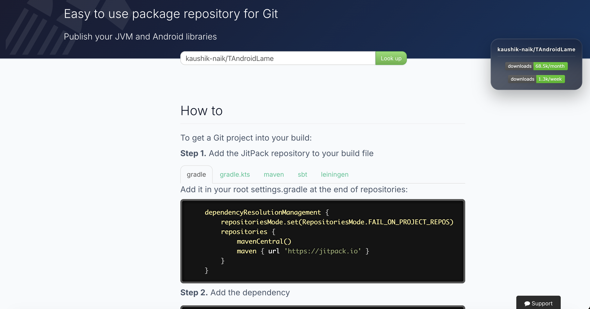

  

# Jitpack Stats Extension

A cross-browser extension that shows download statistics on the right side whenever a user visits a library page on Jitpack.

  

## Installation

### For Chrome / Edge / Brave
1. Go to `chrome://extensions/` (or `edge://extensions/`)
2. Turn on **Developer mode** in the top right.
3. Click **Load unpacked**.
4. Select the directory containing this extension (`jitpack-stats-ext`).

### For Firefox
1. Go to `about:debugging#/runtime/this-firefox`
2. Click **Load Temporary Add-on...**
3. Select any file in the extension directory (e.g., `manifest.json`).

## How it works
The extension listens to URL hash changes on `jitpack.io`. When a valid repository is found (e.g. `https://jitpack.io/#kaushik-naik/TAndroidLame/a485052f28`), it extracts the user (`kaushik-naik`) and repository (`TAndroidLame`) and displays the weekly and monthly download badges on the right side of the page.
